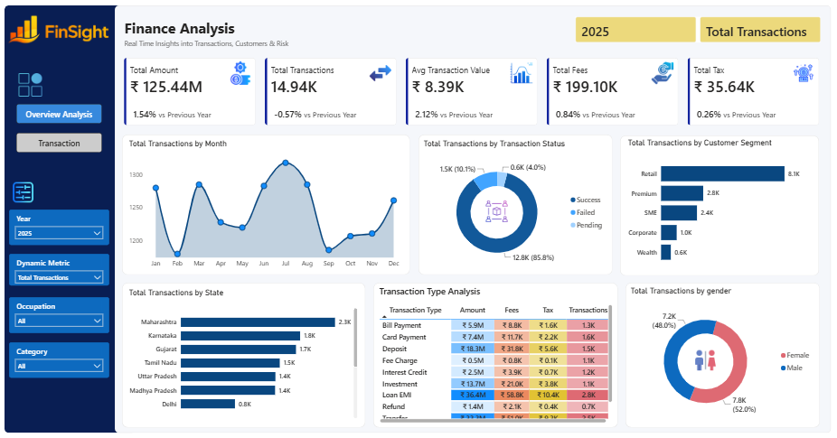
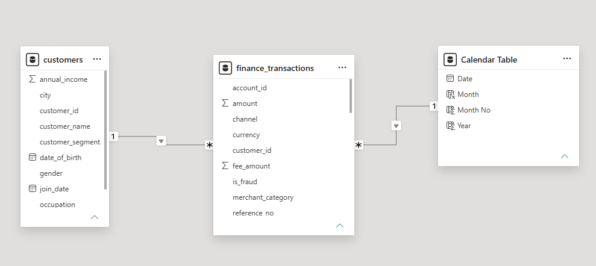
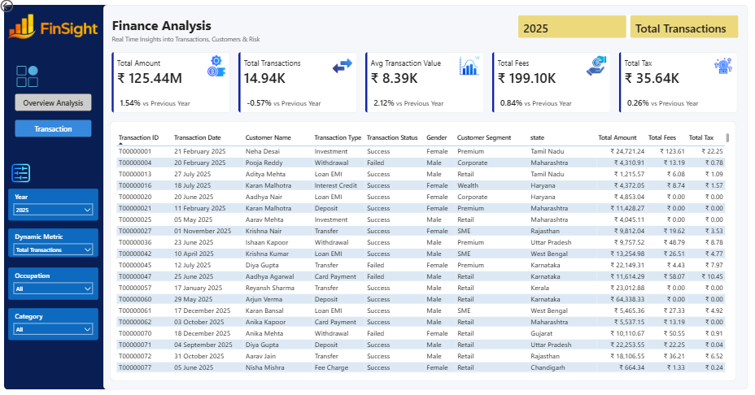

# Finance Analytics Dashboard

--

## Project Overview
This project develops an interactive Power BI dashboard to analyze financial transactions, customer behavior, and transaction performance across different business dimensions. The dashboard is designed to support interactive KPI monitoring and exploratory analysis through dynamic metrics and filters.

---

## Key Financial Metrics (KPIs)
* **Total Amount:** Displays the total transaction amount processed with a Year-over-Year (YoY) growth comparison.
* **Total Transactions:** Tracks the overall transaction volume and yearly changes.
* **Average Transaction Value:** Calculates the average monetary amount per transaction.
* **Total Fees & Taxes:** Monitors total fees collected and total tax generated from all operations.

---

## Analysis & Visualizations
* **Trend Analysis:** Analyzes monthly patterns based on the selected metric to observe changes in transaction activity over time.
* **Transaction Status Analysis:** Compares the selected metric across Success, Failed, and Pending transaction statuses.
* **Customer Segmentation:** Compares the selected metric across customer segments such as Retail, Premium, SME, Corporate, and Wealth.
* **Geographical Analysis:** Compares the selected metric across states to identify differences in transaction activity by region.
* **Transaction Type Analysis:** Compares Amount, Fees, Tax, and Transactions across different transaction types.
* **Demographic Analysis:** Compares the selected metric across customer gender.

---

## Technical Implementation & Data Modeling

* **Star Schema Design:** Built a star-schema model with 'finance_transactions' as the central fact table and 'customers' and 'Calendar' Table as supporting dimension tables. The model supports analysis across transaction, customer, and date dimensions.
* **Custom Calendar Table:** Created a dedicated Calendar Table to support date-based analysis and time-intelligence calculations, including Year-over-Year comparisons.
* **Data Transformation:** Prepared the raw transaction data in Power Query by setting data types, transforming monetary fields, handling duplicate transaction IDs, trimming text values, handling missing fee values, and standardizing currency formatting.

---

## Interactive Features
* **Dynamic Filtering:** Allows users to dynamically slice data by Year, Dynamic Measure, Occupation, and Category for tailored business analysis.
* **Drill-Down Capabilities:** Includes a detailed grid view dashboard to inspect underlying transactional records at a granular level.

---

## Tools & Technologies
* **BI Tool:** Power BI Desktop
* **Data Processing:** Power Query
* **Calculations:** DAX (Data Analysis Expressions)

---

## How to Interact with the Dashboard
1. Download the `.pbix` file from this repository.
2. Open the file using Power BI Desktop.
3. Use the page navigation to switch between Overview Analysis and Transaction, and use the available slicers to filter the analysis.

---

## 📬 Contact

Open to discussion, feedback, or collaboration opportunities related to this project.

